# Windows Okta Device Trust

## Windows Device Management via Iru SCEP

## Summary

This document provides a complete technical guide for implementing Okta Device Trust on Windows endpoints managed through Iru. Unlike Apple devices (iOS and macOS), which benefit from a native, pre-built Okta Device Trust integration in Iru, Windows devices require a manual configuration approach using the Simple Certificate Enrollment Protocol (SCEP).
The integration works by deploying a SCEP certificate from Okta’s Certificate Authority to each Windows device via Iru’s SCEP Library Item. Once the certificate is present and the device is registered with Okta Verify, Okta recognizes the device as “Managed,” enabling administrators to enforce device trust policies in their authentication rules.
This document also addresses a known deployment issue where the SCEP certificate is installed to the Local Machine certificate store rather than the Current User store, which prevents the logged-in user from accessing the certificate’s private key. A PowerShell remediation script is provided to resolve this by granting the logged-in user read access to the private key.

## Architecture Overview

The integration involves three components working together:

| Component | Role | Description |
| --- | --- | --- |
| Okta | Certificate Authority & Identity Provider | Issues SCEP certificates, maintains the device directory, and evaluates device trust in authentication policies. |
| Iru | Endpoint Management (MDM) | Deploys the SCEP certificate profile to Windows devices, manages Blueprints, and runs remediation scripts. |
| Windows Device | Endpoint | Receives the SCEP certificate, runs Okta Verify, and authenticates the user. The private key ACL remediation script runs here. |

## Prerequisites

Before beginning the implementation, ensure the following are in place:

- An active Okta tenant with administrative access.
- An Iru tenant with administrative access and at least one Windows Blueprint configured.
- Okta Verify installed on the target Windows device(s). It can be deployed as an Iru Auto App with no special parameters required.

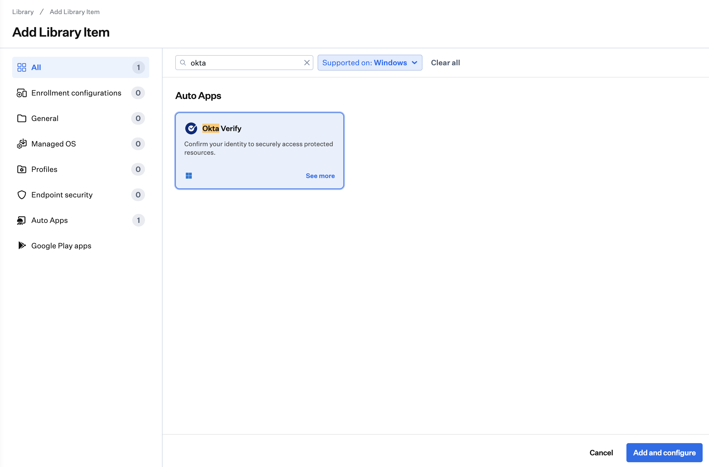

## Okta Tenant Configuration

### Step 1: Add a Desktop Endpoint Management Platform
1. In the Okta Admin Console, navigate to Security > Device Integrations > Endpoint Management.
2. Click Add platform.
3. Select Desktop (Windows and macOS only) and click Next.
4. Under Certificate authority, select Use Okta as your certificate authority.
5. Under SCEP URL challenge type, select Static SCEP URL.
6. Copy the SCEP URL and the Secret Key and store them securely. You will need both when configuring the Iru SCEP Library Item.
7. Click Save.

> [!IMPORTANT]
> The Secret Key is shown only once at the time of creation. If you lose it, you will need to regenerate a new key.

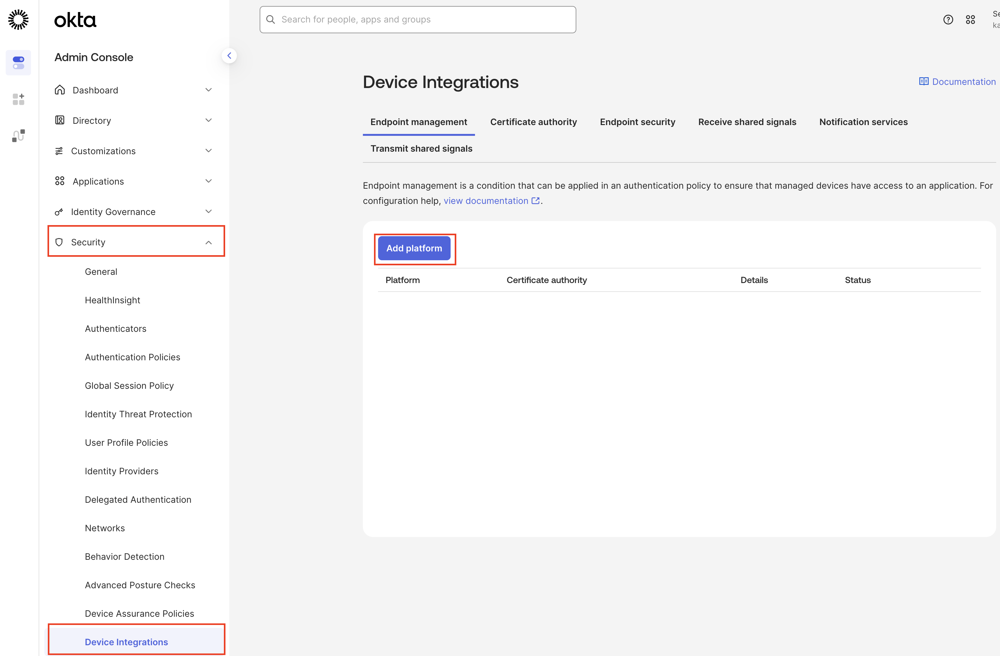

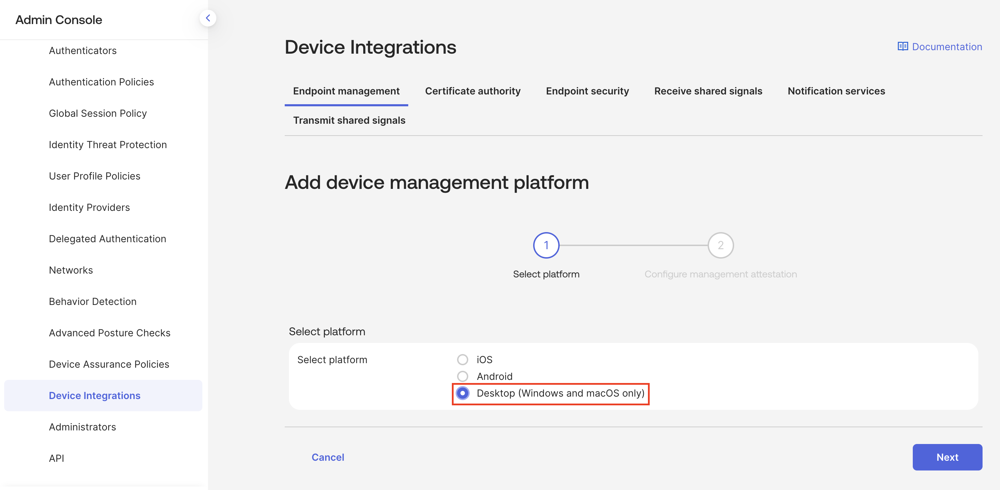

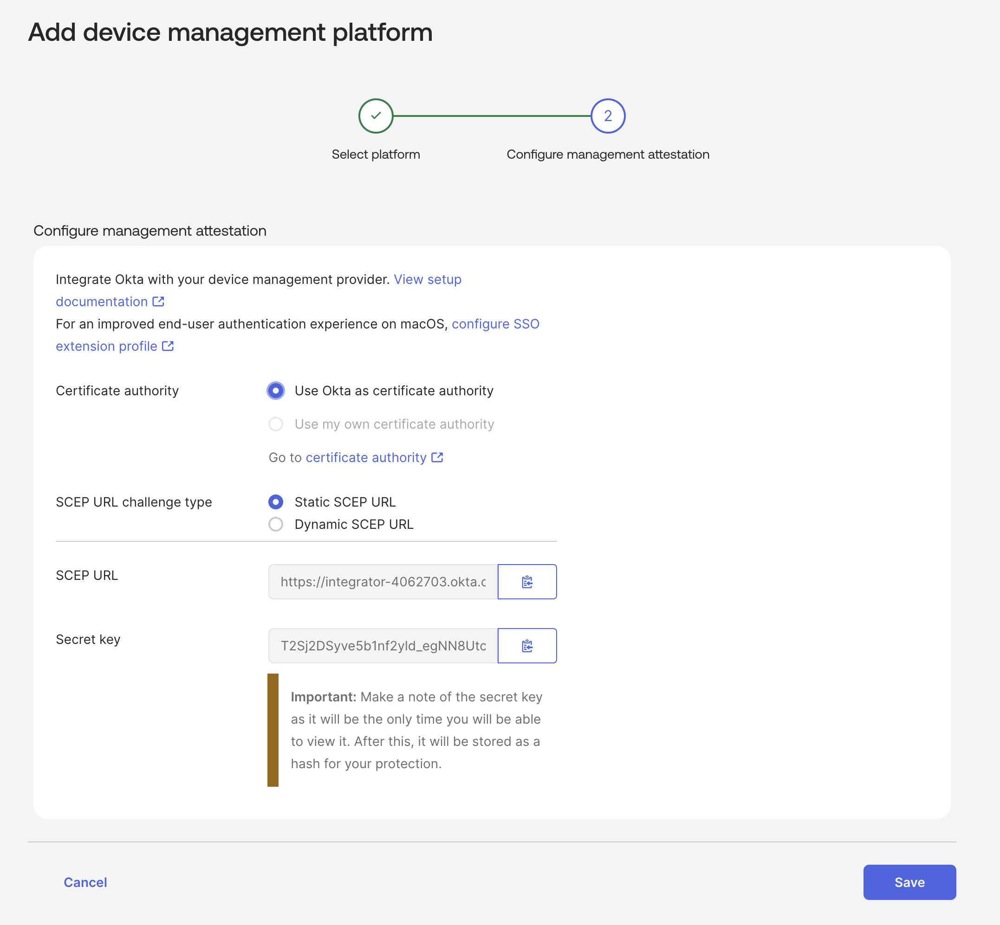

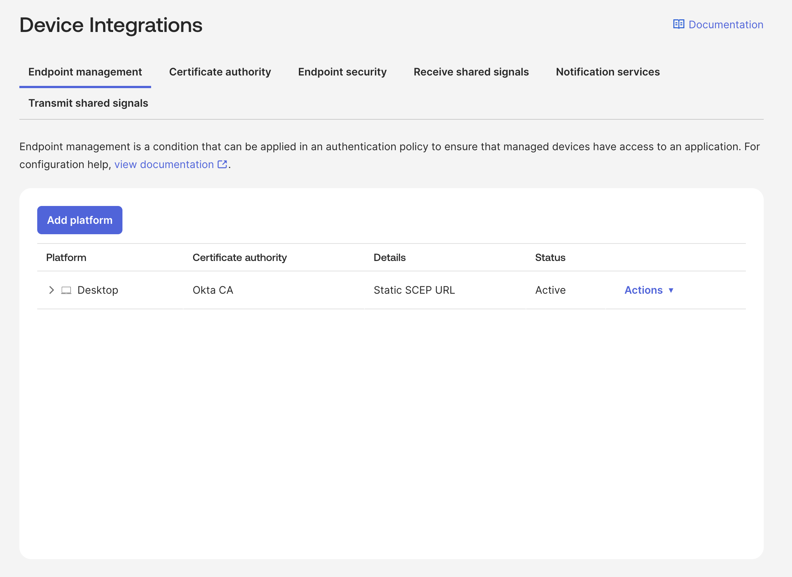

## Step 2: Obtain the CA Certificate Fingerprint

1. In the same Device Integrations area, navigate to the Certificate Authority tab.
2. Locate the Okta CA entry and click the download icon to download the CA certificate.
3. Ensure the downloaded file has a .pem extension.
4. Open the certificate and locate the Fingerprints section.
    
    PowerShell (easiest on Windows):
    
    ```powershell
    # Save the PEM content to a file first (e.g., okta-ca.pem), then:
    $cert = New-Object System.Security.Cryptography.X509Certificates.X509Certificate2("C:\path\to\okta-ca.pem")
    $cert.GetCertHashString("SHA256") -replace '(.{2})', '$1 '
    ```
    
    Or using OpenSSL (if available):
    
    ```powershell
    openssl x509 -in okta-ca.pem -noout -fingerprint -sha256
    ```
    
5. Copy the SHA-256 fingerprint value. Store this alongside the SCEP URL and Secret Key.

> [!NOTE]
> You will need three values from Okta for the Iru configuration: the SCEP URL, the Secret Key (challenge), and the SHA-256 fingerprint of the CA certificate.

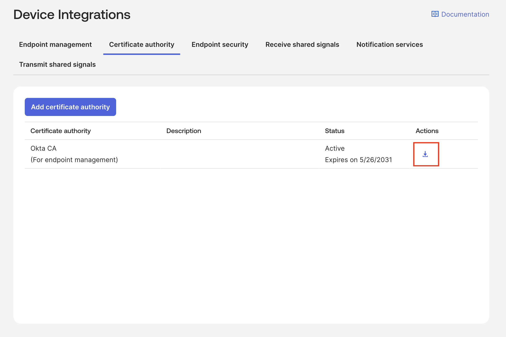

## Iru SCEP Library Item Configuration
### Create the SCEP Library Item
1. In the Iru console, navigate to Library and add a new SCEP Library Item.
2. Configure the General Settings as follows:

| **Field** | **Value** | **Notes** |
| --- | --- | --- |
| URL | Your Okta SCEP URL | The base URL for the SCEP server, copied from Okta. |
| Name (optional) | Okta | A friendly identifier for the SCEP server. Optional but recommended. |
| Challenge | Your Okta Secret Key | The pre-shared secret used for automatic SCEP enrollment. |
| Fingerprint | SHA-256 value from Okta CA | The hex fingerprint of the Okta CA certificate. |
| Subject | CN=$SERIAL_NUMBER | Uses the device serial number as the certificate Common Name, identifying the device within the CA. |
| Key Size | 2048 | Standard RSA key length. |
| Key Usage | Signing |   |
| Retries | 3 | Number of retry attempts if the server returns PENDING. |
| Automatic Profile Redistribution | 30 days | Days before certificate expiration to trigger automatic renewal. |
| Hash Algorithm | SHA-256 | Windows-only setting. |
| Retry Wait Time in Minutes | 5 | Wait time between retries on PENDING response. |
| Extended Key Usage | Client Authentication, Any | Required for the certificate to be used for client authentication. |
| Key Protection | Not configured | Can optionally be set to TPM if desired. |
| Valid Period | Not configured | Defaults to the CA-defined validity period. |

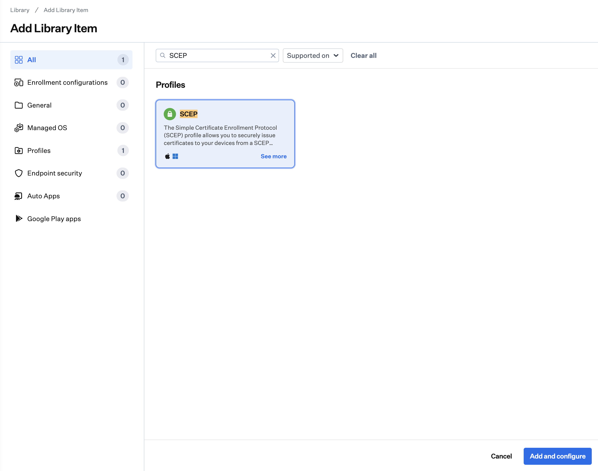

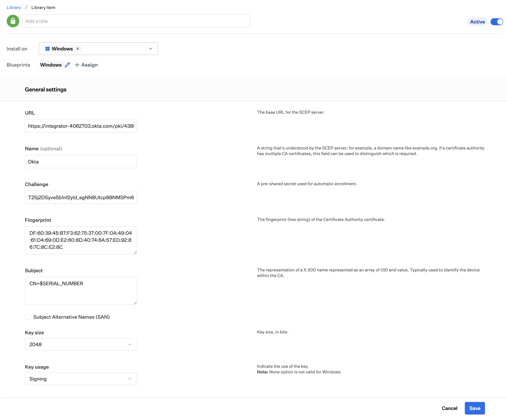

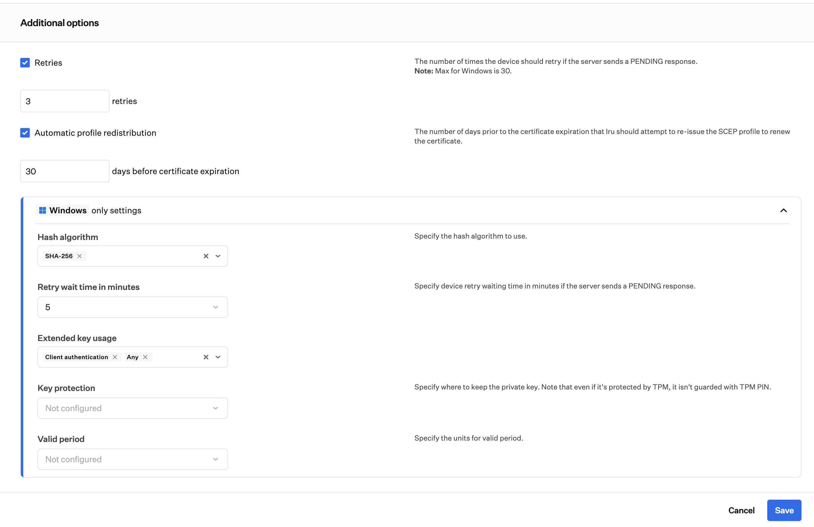

### Assign to Blueprint

After saving the SCEP Library Item, assign it to your Windows Blueprint. The profile will be deployed to all devices in that Blueprint on their next check-in.

## Verification

### Iru Device Status
In the Iru console, navigate to Devices and check the device record. A successful deployment will show the SCEP certificate as installed and managed, including details such as the thumbprint, subject CN, issuer, validity dates, and rotation schedule.

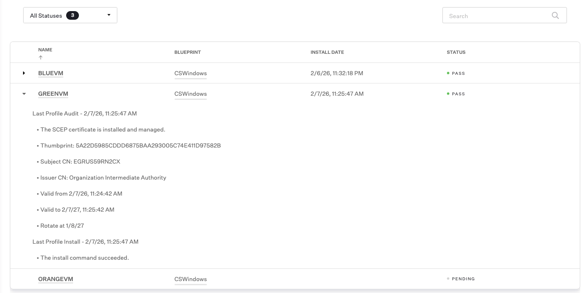

### Okta System Log
In the Okta Admin Console, navigate to Reports > System Log. Look for an event with the action “Bind client certificate to device” with a status of SUCCESS. This confirms that Okta has received and bound the certificate to the device record.

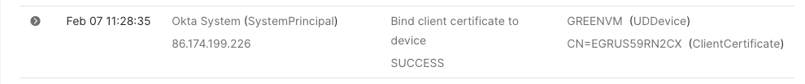

### Okta Device Directory
Navigate to Directory > Devices in the Okta Admin Console and search for the device. If the Status column shows “Managed,” the Device Trust integration is working correctly and you can begin enforcing authentication policies that require managed devices.

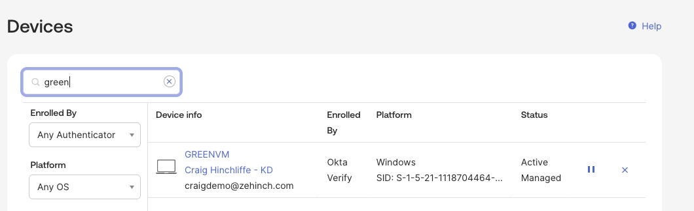

## Known Issue: Certificate Store Placement
### Problem Description
When the SCEP Library Item deploys the certificate to a Windows device, it is installed into the Local Computer certificate store (Cert:\LocalMachine\My) rather than the Current User store (Cert:\CurrentUser\My). Windows security prevents standard user accounts from reading private keys in the Local Machine store. Since Okta Verify runs in the user’s context, it cannot access the private key, which causes the Device Trust attestation to fail.

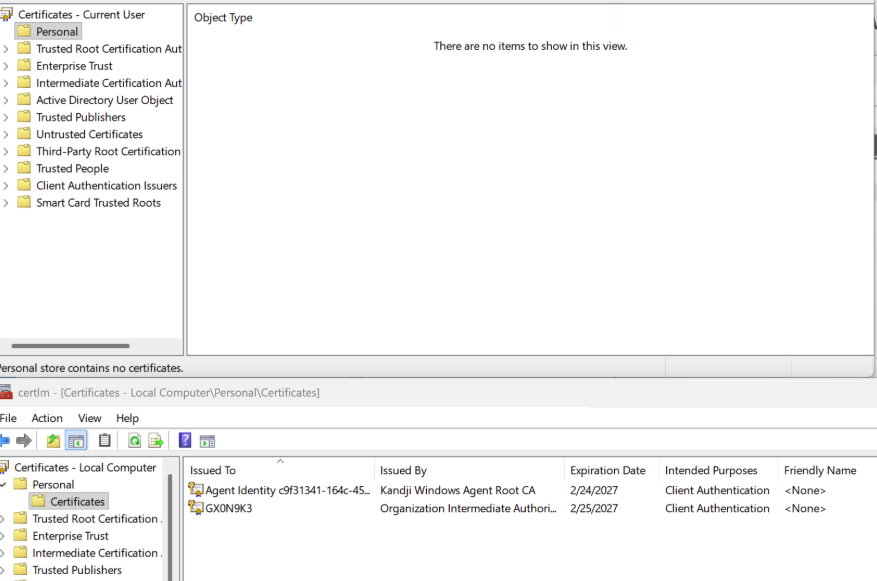

### Remediation Options
#### Option 1: Update the SCEP Profile (Not Available Yet)
The most secure and sustainable resolution is to update the SCEP profile in Iru to deploy the certificate directly to the Current User store. Once the old certificate is removed and the updated profile syncs, a new certificate will be generated in the correct store, permanently resolving the issue. 

#### Option 2: Grant Private Key Read Access via Script (Workaround)
Since an immediate profile change is not feasible, you can grant the logged-in user explicit read access to the private key in the Local Machine store. This approach modifies the default security permissions on the key material and should be considered an interim solution. The PowerShell script described in the following section automates this process.

## Private Key ACL Remediation Script
### Overview

The remediation script is a PowerShell script designed to run with SYSTEM-level privileges (for example, deployed as an Iru Custom Script via the Iru Agent). The current script version is 2.0; see the `.NOTES` section of the script header for the full changelog. It performs the following operations:

1. Detects the currently logged-in interactive user and resolves their SID.
2. Selects the target certificate from the Local Machine store — either deterministically (via an exact -Thumbprint, or an -IssuerMatch regex applied to the Issuer DN) or heuristically, by scoring candidates against configurable search hints and the Client Authentication extended key usage. Only currently valid certificates with a private key are considered, and the heuristic fails closed if no hint matches.
3. Determines whether the private key is backed by a CNG (Cryptography Next Generation) provider or a legacy CSP (Cryptographic Service Provider).
4. Grants the logged-in user GENERIC_READ access to the private key, using either the NCrypt DACL API (for CNG keys) or file-system ACL modification (for legacy file-backed keys).

### Script Parameters
| **Parameter** | **Type** | **Default** | **Description** |
| --- | --- | --- | --- |
| $Thumbprint | String | None | Exact SHA-1 thumbprint of the target certificate. Bypasses all heuristics. Note that SCEP renewal reissues the certificate with a new thumbprint, so a pinned thumbprint stops matching after renewal. |
| $IssuerMatch | String | None | Regex applied to the Issuer DN as a hard filter before scoring. Survives certificate renewal; recommended for production deployments. |
| $SearchHints | String[] | 'Okta', 'SCEP' | Keywords matched case-insensitively against the certificate Subject, Issuer, FriendlyName, and DNS SANs. Each match adds 40 points. Extend with a tenant-specific identifier. |
| $MinimumScore | Int | 40 | Minimum score required to act. The default requires at least one SearchHints match; the Client Authentication EKU alone (30 points) is deliberately insufficient. |
| $WhatIf | Switch | False | Reports the changes the script would make without modifying any ACLs (standard ShouldProcess support; -Confirm is also available). Use this for testing. |

> [!NOTE]
> Customize the $SearchHints array to include your Okta tenant-specific identifier (e.g., your Okta org subdomain or a unique string from the certificate subject/issuer), or skip the heuristic entirely with -IssuerMatch or -Thumbprint. This ensures the script identifies the Okta SCEP certificate among all certificates in the Local Machine store.

### Certificate Scoring Algorithm
When no -Thumbprint is supplied, the script scores candidates to identify the correct certificate. Having a private key, being currently valid (within NotBefore/NotAfter), and matching -IssuerMatch (when set) are hard requirements applied before scoring — they carry no points, because every surviving candidate satisfies them:

| **Criterion** | **Points** | **Rationale** |
| --- | --- | --- |
| Client Authentication EKU (OID 1.3.6.1.5.5.7.3.2) present | +30 | Required for Okta, but common to many certificates (MDM enrollment, EAP-TLS), so it is deliberately insufficient on its own |
| Each SearchHint keyword match in Subject/Issuer/FriendlyName/DNS SANs | +40 each | Tenant identification — at least one match is required to clear the default threshold of 40 |

The certificate with the highest score at or above the MinimumScore threshold is selected, and selection fails closed: if no candidate reaches the threshold, the script exits without modifying anything. Ties are resolved by subject — certificates with the same Subject tying on score (the renewal-overlap case) resolve to the latest NotAfter, while distinct certificates tying on score abort the script with guidance to re-run with -IssuerMatch or -Thumbprint.

### How the Script Works
**Step 1: User Detection**

The script first attempts to identify the logged-in user via Win32_ComputerSystem.UserName. If that fails, it falls back to finding the owner of the explorer.exe process. The user’s SID is resolved for use in ACL operations.

**Step 2: Certificate Selection**

If -Thumbprint is supplied, the certificate is looked up directly and heuristics are skipped. Otherwise, all certificates in Cert:\LocalMachine\My with a private key and valid date range (optionally narrowed by -IssuerMatch) are scored using the algorithm above, and the top candidate is selected — subject to the fail-closed threshold and the ambiguity guard described in the scoring section.

**Step 3: Key Type Detection**

The script attempts to access the private key as an RSA CNG key or an ECDSA CNG key. If successful, it retrieves the CNG key handle, provider name, unique name, and whether the key is TPM-backed.

**Step 4: ACL Modification**

For CNG-backed keys, the script uses the NCrypt API (via P/Invoke) to read the existing DACL security descriptor, add a GENERIC_READ ACE for the logged-in user’s SID, and write the updated descriptor back. For legacy file-backed keys, it locates the private key file on disk and applies a standard file-system Read ACL entry.

### Deployment via Iru
The script should be deployed as a Custom Script in Iru, assigned to the same Blueprint as the SCEP profile. Ensure it runs with SYSTEM-level privileges. It can also be run manually on individual devices for troubleshooting. For production deployments, prefer pinning the certificate with -IssuerMatch over -Thumbprint: SCEP renewal reissues the certificate with a new thumbprint, while the issuer stays stable across renewals.

- [Grant-OktaSCEPPrivateKeyAccess.ps1](Grant-OktaSCEPPrivateKeyAccess.ps1)

> [!IMPORTANT]
> This script modifies security ACLs on cryptographic key material. Always test with the -WhatIf switch first. Review the output carefully before running in production.

## Configuring Okta Authentication Policies
Once devices are showing as “Managed” in the Okta device directory, you can enforce Device Trust in your authentication policies:

1. In the Okta Admin Console, navigate to Security > Authentication Policies.
2. Select or create the policy that applies to the applications you want to protect.
3. Add or modify a rule that includes the condition “Device: Managed.”
4. Set the action to Allow for managed devices, and Deny (or require step-up authentication) for unmanaged devices.
5. Save the policy and test with a managed and an unmanaged device.

## Troubleshooting
| **Symptom** | **Resolution** |
| --- | --- |
| Device shows as “Registered” but not “Managed” in Okta | Confirm the SCEP certificate was deployed successfully in the Iru device record. Check the Okta System Log for a “Bind client certificate to device” event. If missing, the certificate may not have reached Okta. |
| Script reports “Could not confidently identify the Okta/SCEP certificate” | Add a tenant-specific identifier to $SearchHints, or target the certificate deterministically with -IssuerMatch or -Thumbprint. Avoid lowering $MinimumScore below 40 — that removes the requirement for a hint match, and the script may select an unrelated client-authentication certificate. |
| Script aborts with “Ambiguous match” | Two distinct certificates scored identically. Re-run with -IssuerMatch (recommended) or -Thumbprint to disambiguate. |
| Certificate is present but Okta Verify cannot use it | Run the remediation script with -WhatIf first to confirm it identifies the correct certificate and key. Then run without -WhatIf. Restart Okta Verify after the ACL change. |
| Script fails with “No interactive user logged in” | The script must run while a user is interactively logged in. Ensure it is not running during device provisioning before a user has signed in. |
| Script reports the provider does not support key security descriptors | The script checks NCrypt security-descriptor support before attempting the change. If the key’s provider (for example, some TPM configurations) does not report support, the ACL cannot be modified through NCrypt. Verify the provider name in the script output and consult Iru support. |

## References
- Iru SCEP Library Item Documentation: [https://docs.iru.com/en/endpoint/library/library-items-profiles/configure-the-scep-library-item](https://docs.iru.com/en/endpoint/library/library-items-profiles/configure-the-scep-library-item)
- Iru Blog – Okta Device Trust Integration: [https://www.iru.com/blog/archive/okta-device-trust-integration](https://www.iru.com/blog/archive/okta-device-trust-integration)
- Okta Device Trust Documentation: [https://help.okta.com](https://help.okta.com) (search “Device Trust”)
- Microsoft NCrypt API Reference: [https://learn.microsoft.com/en-us/windows/win32/api/ncrypt/](https://learn.microsoft.com/en-us/windows/win32/api/ncrypt/)