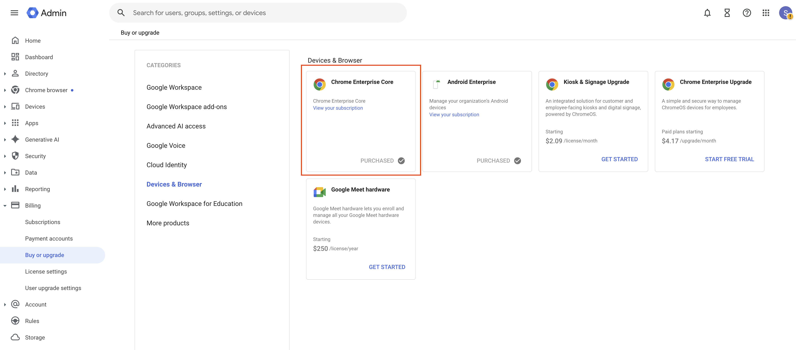
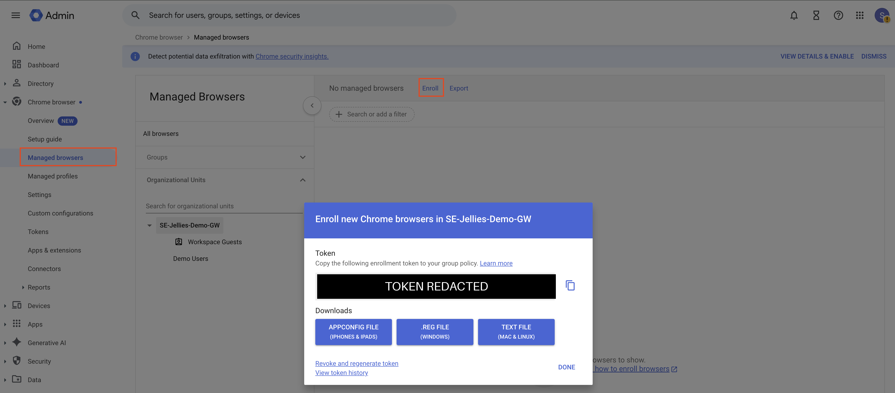
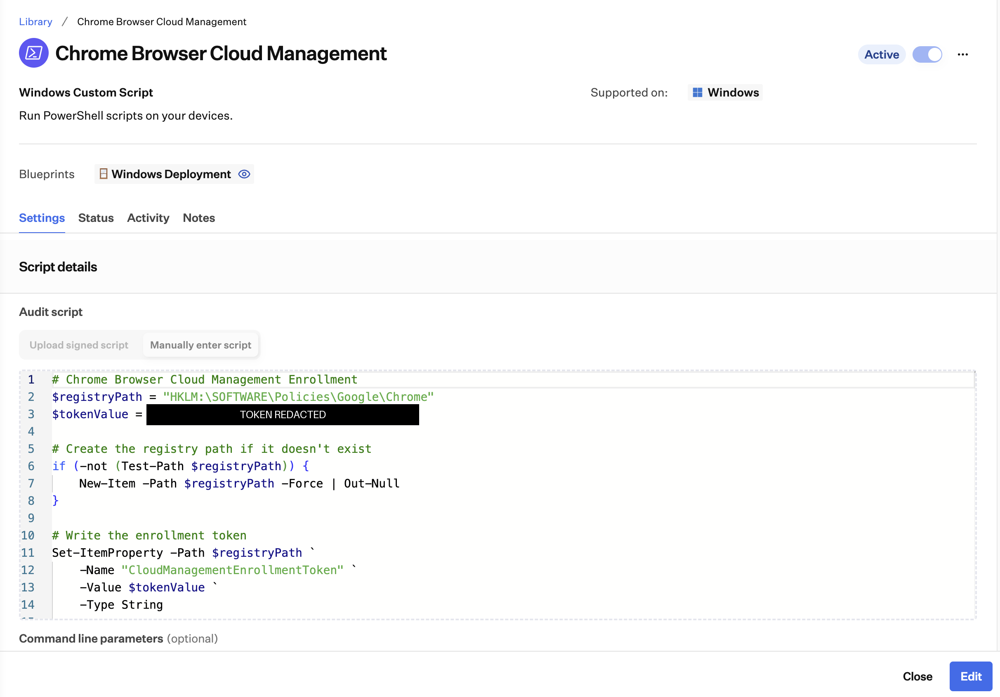
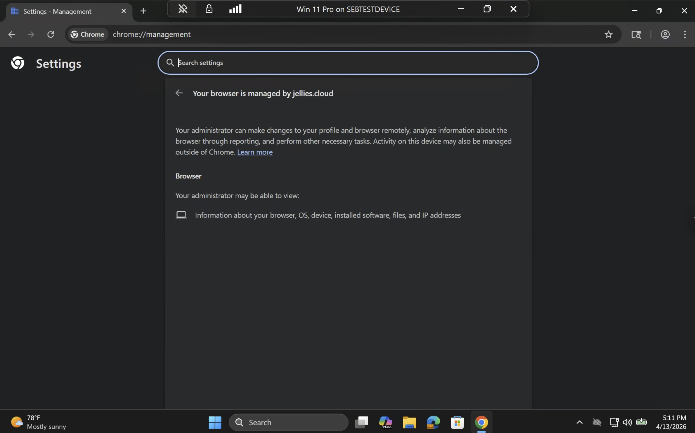
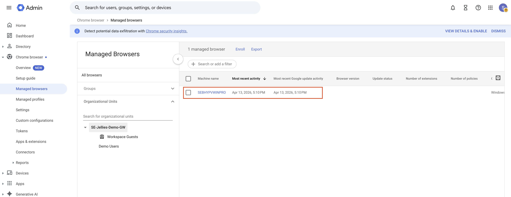
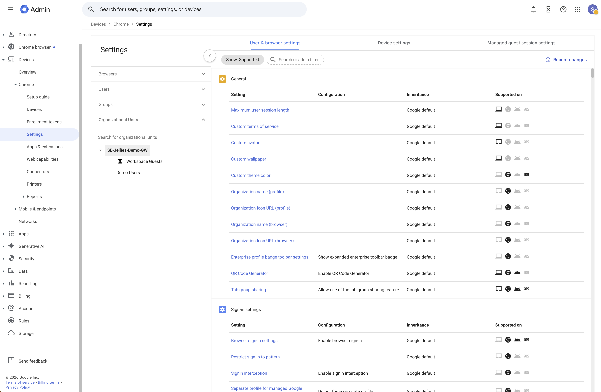
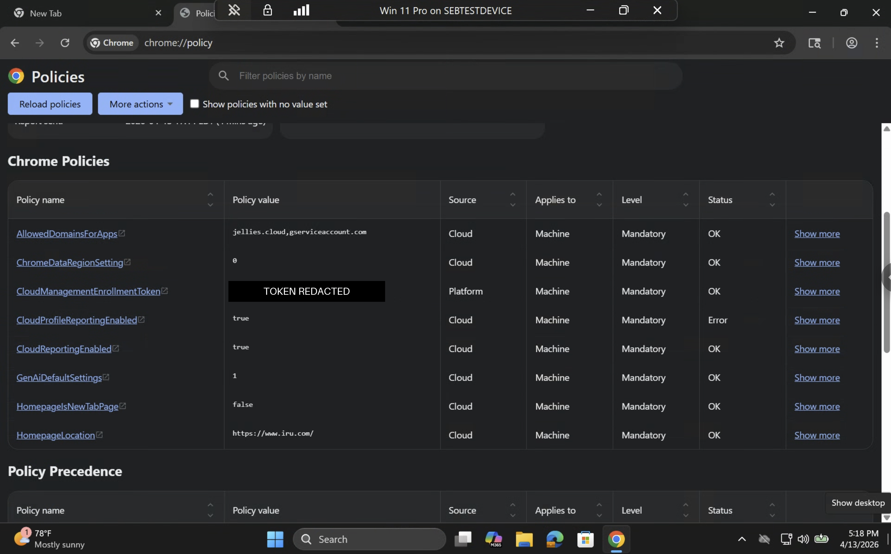

# Manage-ChromeCBCMEnrollment.ps1

Enrolls Google Chrome on Windows into **Chrome Browser Cloud Management (CBCM)** by writing a Chrome Enterprise Core enrollment token to the machine-level Chrome policy key. Once enrolled, Chrome pulls all policies — extensions, hardening settings, homepage enforcement, Safe Browsing, and more — directly from Google Admin, keeping Chrome management unified across Mac and Windows fleets from a single console.

- **Script:** `Manage-ChromeCBCMEnrollment.ps1` (v1.0.0)
- **Target OS:** Windows 10 / Windows 11 with a **system-level** (per-machine) Chrome install
- **Runs as:** SYSTEM (Iru Custom Script) or elevated admin shell
- **PowerShell:** 5.1, no external modules

| **Category** | Chrome / Browser Management |
| --- | --- |
| **Platform** | Windows (Iru UEM) |
| **Status** | Interim workaround (native ADMX support on Iru roadmap) |
| **Prerequisites** | Google Admin access, Iru UEM admin access, Chrome Enterprise Core (free) |

---

## Background & why this approach

Iru UEM has native ADMX-style Chrome profiles for Windows on the roadmap, but that feature is not yet available. In the meantime, CBCM provides the same outcome: centralized, policy-driven Chrome management via Google Admin — the same system already used for Mac.

Key advantages:

- Chrome Enterprise Core is free — no additional licensing required
- Management stays unified in Google Admin across Mac and Windows fleets
- The deployment is minimal — a single registry value written by a small PowerShell script
- Policies apply automatically once Chrome registers as managed

---

## Policy mapping: Intune → CSP → registry

CBCM enrollment has **no native CSP** — on Windows it is ADMX-backed only. In Intune it is deployed via the ADMX-ingested Chrome policy (Google also publishes a [dedicated Intune enrollment guide](https://support.google.com/chrome/a/answer/10728773)); this script writes the same registry state directly.

| Intune anchor | CSP node | Registry value |
|---|---|---|
| ADMX-ingested Chrome policy **CloudManagementEnrollmentToken** (Settings Catalog has no native entry; ADMX ingestion generates a tenant-specific node path, not reproduced here to avoid guessing) | *None — no native CSP for CBCM enrollment* | `HKLM\SOFTWARE\Policies\Google\Chrome\CloudManagementEnrollmentToken` (`REG_SZ`) |

**Machine-level only (vendor-documented).** Google's [enrollment guide](https://support.google.com/chrome/a/answer/9301891) states the token *"must be set at a local machine level. It won't work at the user level,"* and that *"on Windows, only system installations are supported because Chrome browser requires admin privileges to register."* A per-user Chrome install (under `%LOCALAPPDATA%`) cannot enroll, and an `HKCU` token placement does nothing.

### Token lifecycle: enrollment token vs. DM token

Two different tokens are involved, and conflating them causes most CBCM confusion:

- The **enrollment token** (what this script writes) is only used at enrollment time. On launch, an unenrolled system-level Chrome reads it, registers with Google's Device Management server, and receives a **DM token** (device management token) that identifies the browser from then on. Per Google: *"Enrollment tokens are only used during enrollment"* — revoking or removing one later leaves enrolled browsers enrolled (vendor-documented, [enrollment guide](https://support.google.com/chrome/a/answer/9301891)).
- The **DM token** is stored on Windows at `HKLM\SOFTWARE\Google\Chrome\Enrollment` and `HKLM\SOFTWARE\WOW6432Node\Google\Enrollment`, value `dmtoken` (vendor-documented, same guide). Its presence is what Discover mode uses as the enrollment-success signal — the *location* is vendor-documented; *using its presence as a health check* is this script's own design (inferred).
- **Unenrollment is performed from Google Admin**, not the registry: select the browser under **Chrome browser → Managed Browsers** and click **Delete**, which removes cloud policies and invalidates the device token the next time Chrome opens (vendor-documented, same guide). This is why the script's Revert mode — which removes only the enrollment token value — explicitly does **not** unenroll an already-enrolled browser.

---

## Configuration reference

All settings are in the `CONFIGURATION` block at the top of the script — edit nothing below it. Iru Custom Scripts run without parameters, so settings are variables.

| Variable | Default | Purpose |
|---|---|---|
| `$Mode` | `'Enforce'` | `Enforce` \| `Audit` \| `Discover` \| `Revert` |
| `$EnrollmentToken` | `'YOUR_TOKEN_HERE'` | The Chrome Enterprise Core enrollment token from Google Admin. The script refuses to run Enforce or Audit while this is still the placeholder (exit 2). |
| `$LogDirectory` / `$LogFile` | `%ProgramData%\IruScripts\Logs\Manage-ChromeCBCMEnrollment.log` | Timestamped log, appended per run, mirrored to stdout |

Machine-local state (last-run metadata; never the token itself, only a masked preview) is stamped under `HKLM\SOFTWARE\IruScripts\ChromeCBCM` and removed by Revert.

### Modes & exit codes

| Mode | Does | Exit 0 | Exit 1 | Exit 2 |
|---|---|---|---|---|
| `Enforce` | Creates `HKLM\SOFTWARE\Policies\Google\Chrome` if missing, writes the token as `REG_SZ`, verifies the write | Written & verified (or already correct) | Write or verification failed | Not elevated / placeholder token |
| `Audit` | Compares the live value to `$EnrollmentToken`, changes nothing | Compliant | Drift (value absent or different) | Not elevated / placeholder token |
| `Discover` | Reports system-level Chrome install state, current token value (masked), and DM-token presence | Report produced | Runtime failure | Not elevated |
| `Revert` | Removes the `CloudManagementEnrollmentToken` value and the script's state key — **nothing else** | Removed / already absent | Removal failed | Not elevated |

Two deliberate design decisions, for the record:

- **Missing system-level Chrome is a logged WARNING, not exit 2.** Google's flow has Chrome consume the token at its next launch, so pre-staging the token before Chrome is installed is a valid deployment order (inferred from the vendor-documented enrollment-at-launch behavior) — common in Iru rollouts where the Chrome Custom App and this Custom Script land in the same blueprint without ordering guarantees. Hard-failing would put every not-yet-installed machine into a permanent remediation-failure state for a condition that resolves itself. The warning is logged consistently in Enforce, Audit, and Discover.
- **The placeholder-token gate (exit 2) applies to Audit as well as Enforce.** The requirement is Enforce-specific, but the dual-slot deployment model puts identical configuration in both slots — an Audit comparing the fleet against the literal text `YOUR_TOKEN_HERE` is meaningless and would report perpetual drift. Misconfiguration is surfaced as a precondition failure in both slots instead.

---

## Setup walkthrough

### Step 1: Enable Chrome Enterprise Core

Before generating an enrollment token, make sure Chrome Enterprise Core is active on your account.

1. In Google Admin, go to **Billing → Devices & Browsers**
2. Confirm **Chrome Enterprise Core** is enabled. If not, activate it — it's free.

> **Note:** If you don't see this option, Chrome Enterprise Core may need to be activated. Look for the "Activate" or "Get started" prompt in the Chrome section of the Admin console. See [Google's Chrome Enterprise Core overview](https://support.google.com/chrome/a/answer/9116814?hl=en).



### Step 2: Generate an enrollment token

1. Sign in to **admin.google.com** with an administrator account
2. Go to **Chrome browser → Managed Browsers** (or **Devices → Chrome → Managed Browsers** depending on your console layout)
3. Optionally select the organizational unit you want browsers to enroll into
4. At the top, click **Enroll**

   > If this is your first enrollment, you'll be prompted to accept the Chrome Enterprise Core Terms of Service

5. Click **Copy enrollment token to clipboard**
6. Click **Done**



The token is the one environment-specific value this deployment needs. Treat it with care: anyone holding it can enroll browsers into your organization, and it can be revoked/regenerated at any time from the same dialog.

### Step 3: Deploy the script via Iru

Deploy [`Manage-ChromeCBCMEnrollment.ps1`](./Manage-ChromeCBCMEnrollment.ps1) as a Custom Script Library Item in Iru. Set `$EnrollmentToken` in the `CONFIGURATION` block to the token copied in Step 2 (see the mode/exit-code table above and the deployment pattern below).

> **Note:** The script must run elevated — Iru's Custom Script Library runs it as `NT AUTHORITY\SYSTEM` automatically, and the script exits 2 if it isn't elevated. Only system-level Chrome installations are supported on Windows: the token must be set at machine level (`HKLM`), not user level (vendor-documented, see the mapping section).



### Step 4: Verify enrollment on a test device

After the script runs, fully quit and relaunch Chrome on the test machine, then navigate to:

```
chrome://management
```

The page should display: **"This browser is managed by your organization."**



You can also confirm from Google Admin by going to **Chrome browser → Managed Browsers** and checking that the device appears in the list.



On the device itself, `$Mode = 'Discover'` reports the same signals from the registry side: system Chrome install state, the current token value (masked), and whether a DM token is present.

### Step 5: Configure policies in Google Admin

Once browsers are enrolling, configure all Chrome policies centrally from:

**Chrome browser → Settings → Browser Settings** (or **Devices → Chrome → Settings**)



From here you can manage:

- Extension installs and blocklists
- Security hardening settings
- Homepage and startup page enforcement
- Safe Browsing and password manager policies

All policies apply automatically to enrolled browsers. On a device, `chrome://policy` shows every applied policy and its source — cloud policies arrive with source **Cloud**, while the enrollment token itself shows as source **Platform** because it comes from the registry:



---

## Deploying via Iru: single-slot vs. audit-and-remediate

The repo's standard pattern deploys the identical script twice on one Library Item:

1. **Audit script slot:** the full script with `$Mode = 'Audit'`. Exit 0 = compliant, exit 1 = drift → triggers remediation.
2. **Remediation script slot:** the identical script with `$Mode = 'Enforce'`.
3. `$EnrollmentToken` set identically in **both** slots.

**Recommendation for this feature: an Enforce-only single-slot deployment is usually the better fit.** The enrollment token is effectively write-once: it is consumed at the browser's next launch, and once the DM token exists the registry value no longer matters to the enrolled browser (vendor-documented — see Token lifecycle above). Continuous audit/remediate adds little beyond keeping the inert value pinned, and it turns an intentional token rotation in Google Admin into permanent "drift" until both slots are updated. Use the dual-slot pattern only if your compliance reporting requires the registry value to stay present and matching fleet-wide; otherwise deploy a single Enforce slot and let Discover/`chrome://management` answer "is it enrolled?"

---

## Verification & troubleshooting

| Issue | Resolution |
| --- | --- |
| `chrome://management` shows unmanaged | Confirm the script ran elevated (check the log at `%ProgramData%\IruScripts\Logs\Manage-ChromeCBCMEnrollment.log`). Verify the registry value exists at `HKLM\SOFTWARE\Policies\Google\Chrome` → `CloudManagementEnrollmentToken`, then fully quit and relaunch Chrome. Run `$Mode = 'Discover'` for a one-shot report. |
| Token is invalid or expired | Revoke and regenerate a new token in Google Admin (**Chrome browser → Managed Browsers → Enroll → Revoke and regenerate token**), update `$EnrollmentToken` in the Library Item, and redeploy |
| Device not appearing in Managed Browsers list | Make sure Chrome was fully quit and relaunched after the script ran, and that the install is system-level — per-user Chrome installs cannot enroll (vendor-documented) |
| Policies not applying after enrollment | Check policies are scoped to the correct OU in Google Admin and allow up to 15 minutes for sync (community-observed timing) |
| Inspect applied policies on the device | `chrome://policy` (use **Reload policies** to force a refresh) |
| Script exits 2 immediately | Not elevated, or `$EnrollmentToken` is still `YOUR_TOKEN_HERE` in an Enforce/Audit slot |

### Behavior matrix (recommended acceptance tests)

| Test | Expected |
|---|---|
| Enforce with placeholder token | Exit 2, nothing written |
| Enforce, system Chrome installed, fresh machine | Value written and verified, exit 0; after Chrome relaunch, `chrome://management` shows managed and a `dmtoken` appears |
| Enforce before Chrome is installed | WARN logged, value written, exit 0; browser enrolls on first launch after a per-machine Chrome install |
| Enforce re-run on compliant machine | "already set" OK line, no registry churn, exit 0 |
| Audit, value matches | Exit 0, COMPLIANT |
| Audit, value absent or different | Exit 1, DRIFT line with masked values |
| Discover | Reports Chrome install (path/version), masked token value, DM-token presence per documented location; exit 0 |
| Revert on an enrolled browser | Value + state key removed, exit 0; browser **stays managed** (`chrome://management` unchanged) |
| Revert on a never-enrolled machine | Value removed; machine will no longer auto-enroll |
| Any mode, not elevated | Exit 2 |

---

## Limitations & security notes

- **Revert does not unenroll.** Removing `CloudManagementEnrollmentToken` only stops *future* enrollments on that machine. An enrolled browser keeps its DM token and remains managed; unenroll it from Google Admin (**Managed Browsers → select → Delete**), which invalidates the device token the next time Chrome opens (vendor-documented).
- **Machine-level / system installs only.** Per-user Chrome installs cannot enroll in CBCM on Windows (vendor-documented). Discover only detects per-machine installs and says so.
- **The enrollment token is a credential.** Anyone holding it can enroll browsers into your Google Admin org. The script never logs or stamps the full value (masked previews only, first 8 characters), but the token does sit in the Library Item configuration and in `HKLM` — both admin/SYSTEM-readable surfaces. If a token leaks, revoke and regenerate it in Google Admin; already-enrolled browsers are unaffected (vendor-documented: tokens are only used during enrollment).
- **Token rotation does not move enrolled browsers.** Changing `$EnrollmentToken` re-points *future* enrollments (e.g., at a different OU); existing enrollments keep their DM token and OU. Move browsers between OUs in Google Admin.
- **Sole-manager assumption, narrowly scoped.** The script owns exactly one value under `HKLM\SOFTWARE\Policies\Google\Chrome` and leaves the key itself (and any other Chrome policies written there by other tooling) untouched, in Enforce and Revert alike. If another engine (Intune ADMX ingestion, GPO) manages the same value during a migration window, last writer wins — retire the old policy before or when deploying this one.
- **A DM token can be deleted from the registry, but don't.** Google documents that deleting the `dmtoken` while an enrollment token remains causes the browser to re-enroll on next restart — useful for vendor-guided troubleshooting, but this script deliberately never touches DM-token keys: they are Chrome's state, not this script's.

## Rollback

Set `$Mode = 'Revert'` and run once (or push as a one-time Iru script). It removes exactly two things: the `CloudManagementEnrollmentToken` value under `HKLM\SOFTWARE\Policies\Google\Chrome`, and the state key `HKLM\SOFTWARE\IruScripts\ChromeCBCM`. To actually unenroll browsers, delete them in Google Admin (see Limitations).

## Exit codes

| Code | Meaning |
|---|---|
| 0 | Success (Enforce/Revert/Discover) or compliant (Audit) |
| 1 | Drift detected (Audit) or one or more runtime operations failed |
| 2 | Precondition failure: not elevated, placeholder token in Enforce/Audit, or invalid `$Mode` |

---

## Related resources

- Google Admin Console: admin.google.com
- [Google's official enrollment guide](https://support.google.com/chrome/a/answer/9301891)
- [Chrome Enterprise Core overview](https://support.google.com/chrome/a/answer/9116814)
- [Chrome Enterprise policy list](https://chromeenterprise.google/policies/)
- [Enroll browsers with Microsoft Intune (Windows)](https://support.google.com/chrome/a/answer/10728773) — Google's guide for the Intune equivalent of this deployment

## Sourcing notes

**Vendor-documented** (Google, linked above — the basis for every registry location and lifecycle claim):

- [Enroll cloud-managed Chrome browsers](https://support.google.com/chrome/a/answer/9301891): the enrollment token registry location (`HKLM\SOFTWARE\Policies\Google\Chrome` → `CloudManagementEnrollmentToken`); *"the token must be set at a local machine level. It won't work at the user level"*; *"on Windows, only system installations are supported"*; *"enrollment tokens are only used during enrollment"*; the DM-token locations (`HKLM\Software\Google\Chrome\Enrollment` and `HKLM\Software\WOW6432Node\Google\Enrollment`, value `dmtoken`); deleting the enrollment token leaves browsers enrolled; deleting the `dmtoken` with an enrollment token present re-enrolls the browser on next restart; unenrollment via **Delete** in the Admin console invalidating the device token.
- [Chrome Enterprise policy list](https://chromeenterprise.google/policies/#CloudManagementEnrollmentToken): the `CloudManagementEnrollmentToken` policy itself.
- [Chrome Enterprise Core overview](https://support.google.com/chrome/a/answer/9116814): product activation and licensing (free).

**Community-observed** (widely reported field behavior, verify in your environment):

- The "fully quit and relaunch Chrome" step for registration to happen promptly, and the up-to-~15-minute policy sync window after enrollment.

**Inferred** (own testing or design reasoning, flagged as such in the text):

- Treating DM-token *presence* as Discover's enrollment-success signal (the locations are vendor-documented; their use as a health check is this script's design).
- Pre-staging the token before Chrome is installed being safe and self-resolving (follows from the vendor-documented enroll-at-launch behavior, but Google does not spell out this ordering).
- System-Chrome detection heuristics: probing the two `Program Files` install paths and falling back to the machine-level `App Paths\chrome.exe` registration (a per-user Chrome registers App Paths under `HKCU`, so an `HKLM` hit implies a per-machine install).
